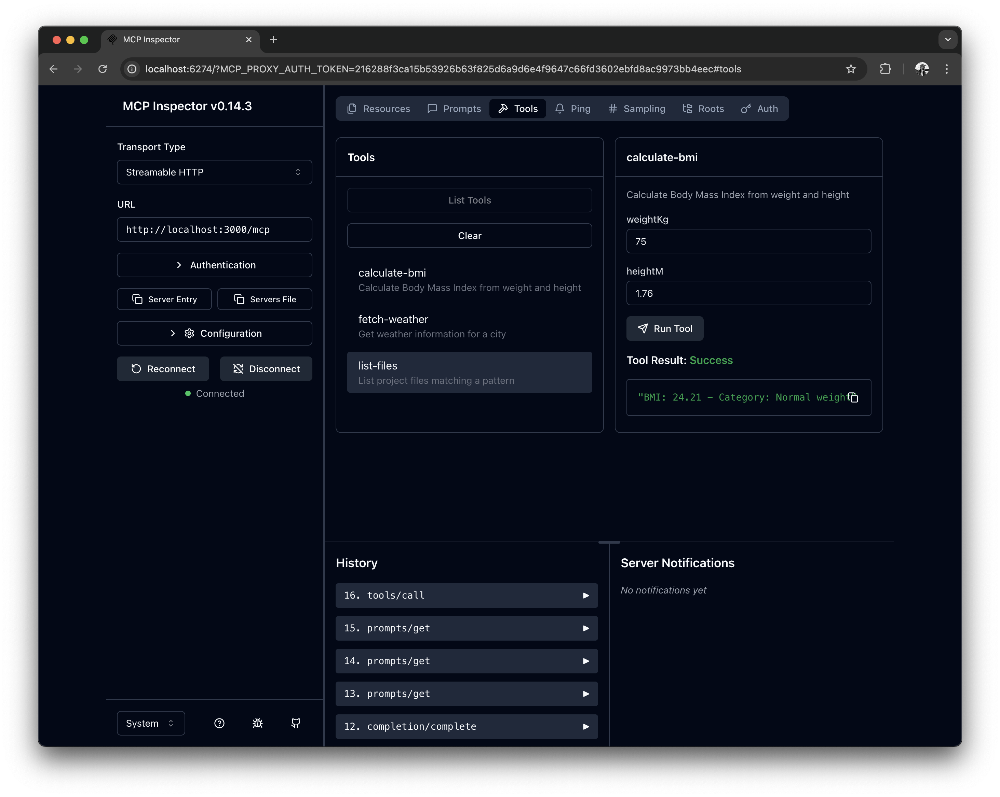

# MCP Server Example

A scalable Model Context Protocol (MCP) server implementation built with Node.js and Express.js, using the official MCP JavaScript SDK.

## 🏗️ Project Structure

```
mcp-server-example/
├── src/
│   ├── config/
│   │   └── server-config.js      # Server configuration
│   ├── server/
│   │   ├── http-server.js        # Express.js HTTP server setup
│   │   ├── http-utils.js         # HTTP utilities and error handling
│   │   └── server.js             # MCP server and session management
│   ├── prompts/
│   │   ├── health-assessment.js  # Health assessment prompt
│   │   ├── project-analysis.js   # Project analysis prompt
│   │   ├── weather-planning.js   # Weather planning prompt
│   │   ├── code-review.js        # Code review prompt
│   │   ├── onboarding.js         # Onboarding prompt
│   │   └── index.js              # Prompt exports and registration
│   ├── resources/
│   │   ├── static-resources.js   # Static resources (config, info)
│   │   ├── dynamic-resources.js  # Dynamic resources with templates
│   │   └── index.js              # Resource exports and registration
│   ├── tools/
│   │   ├── calculate-bmi.js      # BMI calculator tool
│   │   ├── fetch-weather.js      # Weather fetcher tool
│   │   ├── list-files.js         # File listing tool
│   │   └── index.js              # Tool exports and registration
│   └── index.js                  # Main entry point
├── tests/                        # Test suite (JavaScript, run directly)
│   ├── tools.test.js             # Tool functionality tests
│   ├── resources.test.js         # Resource functionality tests
│   ├── prompts.test.js           # Prompt functionality tests
│   ├── server.test.js            # Server architecture tests
│   └── http-integration-test.js  # HTTP integration tests
├── examples/                     # Testing examples and scripts
│   ├── curl/                     # cURL testing scripts
│   │   ├── common.sh             # Shared utilities
│   │   ├── tools.sh              # Tools testing
│   │   ├── resources.sh          # Resources testing
│   │   ├── prompts.sh            # Prompts testing
│   │   └── all.sh                # Complete test suite
│   └── README.md                 # Examples documentation
├── package.json
└── README.md
```

## 🚀 Quick Start

### Prerequisites
- Node.js 18+ 
- npm or yarn

### Installation
```bash
npm install
```

### Running the Server
```bash
# Start the server
npm start

# Development mode with auto-restart
npm run dev

# Test the server
npm test
```

### Testing the Server
```bash
# Easiest way: Use MCP Inspector (web interface)
npx @modelcontextprotocol/inspector
# Then connect to: http://localhost:3000/mcp

# Alternative: Command-line testing
npm run test:manual
```

## 🔧 Available Tools (Examples)

### 1. BMI Calculator (`calculate-bmi`)
Calculates Body Mass Index with health category classification.

**Parameters:**
- `weightKg` (number): Weight in kilograms
- `heightM` (number): Height in meters

**Example:**
```json
{
  "name": "calculate-bmi",
  "arguments": {
    "weightKg": 70,
    "heightM": 1.75
  }
}
```

### 2. Weather Fetcher (`fetch-weather`)
Retrieves weather information for a city (mock data).

**Parameters:**
- `city` (string): Name of the city

**Example:**
```json
{
  "name": "fetch-weather", 
  "arguments": {
    "city": "London"
  }
}
```

### 3. File Lister (`list-files`)
Lists project files matching a pattern.

**Parameters:**
- `pattern` (string): File pattern (e.g., "*.js", "*.md")

**Example:**
```json
{
  "name": "list-files",
  "arguments": {
    "pattern": "*.js"
  }
}
```

## 📚 Available Resources (Examples)

### Static Resources
- `config://app` - Application configuration
- `info://server` - Server information

### Dynamic Resources
- `users://{userId}/profile` - User profiles by ID
- `github://repos/{owner}/{repo}` - GitHub repository info

## 🎯 Available Prompts (Examples)

### 1. Health Assessment (`health-assessment`)
Comprehensive health assessment with BMI calculation and activity recommendations.

**Parameters:**
- `weight` (string): Weight in kilograms
- `height` (string): Height in meters  
- `city` (string): City for weather-based activity recommendations
- `goals` (string, optional): Health or fitness goals

**Example:**
```json
{
  "name": "health-assessment",
  "arguments": {
    "weight": "70",
    "height": "1.75",
    "city": "London",
    "goals": "lose weight and improve fitness"
  }
}
```

### 2. Project Analysis (`project-analysis`)
Comprehensive project analysis and codebase exploration guide.

**Parameters:**
- `focus` (enum): Analysis focus - 'overview', 'structure', 'config', or 'all'
- `fileTypes` (string, optional): Specific file types to analyze (e.g., 'js,json,md')

### 3. Weather Planning (`weather-planning`)
Weather-based activity and travel planning assistant.

**Parameters:**
- `cities` (string): Comma-separated list of cities to check
- `activity` (enum): Activity type - 'travel', 'outdoor', 'fitness', or 'general'
- `duration` (string, optional): Planning duration (e.g., 'weekend', 'week')

### 4. Code Review (`code-review`)
Systematic code review and quality assessment guide.

**Parameters:**
- `scope` (enum): Review scope - 'full', 'changes', or 'specific'
- `focus` (enum): Review focus - 'quality', 'security', 'performance', 'maintainability', or 'all'
- `filePattern` (string, optional): Specific file pattern to review (e.g., '*.js', '*.json')

### 5. Onboarding (`onboarding`)
Comprehensive onboarding guide for new team members and users.

**Parameters:**
- `role` (enum): Role - 'developer', 'user', 'admin', or 'reviewer'
- `experience` (enum): Experience level - 'beginner', 'intermediate', or 'expert'
- `focus` (string, optional): Specific areas of interest or responsibility

## 💡 Using Prompts

The server provides 5 comprehensive prompts that generate contextual guidance for various use cases. Each prompt accepts parameters and returns detailed, actionable instructions tailored to your specific needs.

**Available Prompts:**
- **health-assessment**: BMI calculation with weather-based activity recommendations
- **project-analysis**: Codebase exploration and analysis guidance
- **weather-planning**: Multi-city weather planning for activities
- **code-review**: Systematic code review and quality assessment
- **onboarding**: Role-based onboarding for team members

**Usage Example:**
```bash
# Get health assessment prompt
curl -X POST http://localhost:3000/mcp \
  -H "mcp-session-id: YOUR_SESSION_ID" \
  -d '{
    "method": "prompts/get",
    "params": {
      "name": "health-assessment",
      "arguments": {
        "weight": "70",
        "height": "1.75", 
        "city": "London"
      }
    }
  }'
```

## 🧪 Testing

The project includes comprehensive testing with Node.js built-in test runner:

### Test Structure
```
tests/
├── tools.test.js             # Tool functionality tests (7 tests)
├── resources.test.js         # Resource functionality tests (3 tests)
├── prompts.test.js           # Prompt functionality tests (10 tests)
├── server.test.js            # Server architecture tests (6 tests)
└── http-integration-test.js  # HTTP endpoint integration tests
```

### Running Tests
```bash
# Run all tests
npm test

# Run tests in watch mode (auto-rerun on file changes)
npm run test:watch

# Run HTTP integration tests specifically
npm run test:integration

# Manual testing with cURL
npm run test:manual
```

### Test Coverage
The comprehensive test suite covers:
- ✅ **Tool Functionality**: BMI calculations, weather fetching, file listing
- ✅ **Resource Management**: Static resources (config, info) and dynamic resources (user profiles, repositories)
- ✅ **Prompt System**: Health assessment, project analysis, weather planning, code review, onboarding
- ✅ **Session Management**: Creation, limits, cleanup, and error handling
- ✅ **Server Architecture**: MCP server creation, HTTP server setup, configuration
- ✅ **Integration Components**: Tool, resource, and prompt registration systems
- ✅ **Error Handling**: Edge cases, invalid inputs, malformed requests

**Test Results**: 26 tests across 4 test suites with 100% pass rate

### Manual Testing

#### Browser-based Testing (Recommended)
```bash
# Start the MCP server
npm start

# In another terminal, launch MCP Inspector
npx @modelcontextprotocol/inspector

# Then open your browser to the URL shown (usually http://localhost:5173)
# Connect to: http://localhost:3000/mcp
```


*MCP Inspector interface showing tools, resources, and prompts with interactive testing capabilities*

The MCP Inspector provides a user-friendly web interface to:
- ✅ **Interactive Testing**: Click-based tool execution and resource access
- ✅ **Real-time Results**: See responses formatted and highlighted
- ✅ **Schema Validation**: Built-in parameter validation and help
- ✅ **Session Management**: Automatic session handling
- ✅ **Protocol Debugging**: View raw MCP protocol messages

#### Command-line Testing
```bash
# Health check
curl http://localhost:3000/health

# Individual functionality testing
./examples/curl/tools.sh      # Test tools only
./examples/curl/resources.sh  # Test resources only
./examples/curl/prompts.sh    # Test prompts only

# Complete test suite
./examples/curl/all.sh        # Test everything
```

## 📡 API Endpoints

- `POST /mcp` - Main MCP protocol endpoint (tools, resources, prompts)
- `GET /mcp` - Server-to-client notifications (SSE)
- `DELETE /mcp` - Session termination
- `GET /health` - Health check and server status

### 🌐 Browser Testing
For the easiest testing experience, use the official MCP Inspector:
```bash
npx @modelcontextprotocol/inspector
```
Then connect to `http://localhost:3000/mcp` in the web interface.

### MCP Protocol Methods
- `tools/list` - List available tools
- `tools/call` - Execute a tool
- `resources/list` - List available resources
- `resources/read` - Read a resource
- `prompts/list` - List available prompts
- `prompts/get` - Get a prompt with arguments

## ⚙️ Configuration

Edit `src/config/server-config.js` to customize:

- Server port and host
- Session management settings
- Logging configuration
- MCP protocol settings

### Environment Variables
- `PORT` - Server port (default: 3000)
- `HOST` - Server host (default: localhost)
- `LOG_LEVEL` - Logging level (default: info)
- `NODE_ENV` - Environment (development/production)

## 🔧 Adding New Tools

1. Create a new file in `src/tools/`:
```javascript
// src/tools/my-new-tool.js
import { z } from "zod";

export const myNewTool = {
  name: "my-new-tool",
  config: {
    title: "My New Tool",
    description: "Description of what the tool does",
    inputSchema: {
      param1: z.string().describe("Description of param1"),
      param2: z.number().optional().describe("Optional param2")
    }
  },
  handler: async ({ param1, param2 }) => {
    // Arguments are passed directly via destructuring
    
    // Tool logic here
    
    return {
      content: [{
        type: "text",
        text: "Tool output"
      }]
    };
  }
};
```

2. Export it in `src/tools/index.js`:
```javascript
export { myNewTool } from './my-new-tool.js';

// Add to registerAllTools function
const tools = [calculateBmiTool, fetchWeatherTool, listFilesTool, myNewTool];
```

## 🗂️ Adding New Resources

1. Add to `src/resources/static-resources.js` (for static resources) or `src/resources/dynamic-resources.js` (for templated resources)

2. Resources are automatically registered via `src/resources/index.js`

## 🔒 Session Management

The server includes robust session management:
- Automatic session cleanup
- Session limits (configurable)
- Graceful session termination
- Memory leak prevention

## 🛠️ Development Features

- **JavaScript ES Modules**: Modern JavaScript with ES module syntax
- **Hot Reload**: Use `npm run dev` for auto-restart on file changes
- **Error Handling**: Comprehensive error handling with proper HTTP status codes
- **Logging**: Configurable request logging and server events
- **Health Monitoring**: Built-in health check endpoint
- **Graceful Shutdown**: Proper cleanup on server termination
- **Direct Test Execution**: Tests run directly from JavaScript source using Node.js built-in test runner

## 📋 Scripts

- `npm start` - Start the server
- `npm run dev` - Start with auto-restart (development)
- `npm test` - Run all tests
- `npm run test:watch` - Run tests in watch mode (auto-rerun on changes)
- `npm run test:integration` - Run HTTP integration tests
- `npm run test:manual` - Run manual cURL tests
- `npm run stop` - Stop the running server

## 🤝 Contributing

1. Add new tools in `src/tools/`
2. Add new resources in `src/resources/`
3. Update configuration in `src/config/`
4. Follow the existing JavaScript code structure and patterns
5. Test your changes with the provided test scripts

## 📖 MCP Protocol

This server implements the Model Context Protocol (MCP) version 2024-11-05 using the official JavaScript SDK. For more information about MCP, visit the [official documentation](https://modelcontextprotocol.io/).

### MCP SDK Integration
- Uses official `@modelcontextprotocol/sdk` package
- Proper tool handler signatures with context objects
- JSON schema validation for tool inputs
- Resource templates with completion support
- Session management with transport handling

**Note**: Examples and patterns in this implementation are adapted from the official [MCP TypeScript SDK](https://github.com/modelcontextprotocol/typescript-sdk) repository.

## 📄 License

MIT License - see package.json for details.